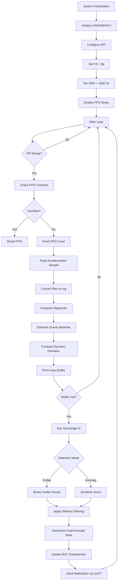

# STM STEVAL-PROTEUS1 BLE Anomalous vibrations environmental monitor

Embedded firmware project for the [**STEVAL-PROTEUS1**](https://www.st.com/en/evaluation-tools/steval-proteus1.html) board implementing:

- Real-time temperature monitoring  
- Vibration-based earthquake detection  
- On-device AI anomaly detection  
- Bluetooth Low Energy (BLE) communication  

---

## Project Overview

The firmwares found in this repository give the STEVAL-PROTEUS1 the ability of:

- Acquiring temperature data from **STTS22H**
- Acquiring vibration data from **ISM330DHCX IMU**
- Performing embedded anomaly detection using **NanoEdge AI**
- Sending measurements and detection results over **Bluetooth Low Energy**

The system exposes:

- A custom BLE service: `TEMPEQA`
- Two characteristics:
  - `Temperature`
  - `Earthquake`

The data can be accessed using either Generic GATT clients (e.g., LightBlue) or ST BLE Sensor mobile application.

For a complete architectural description, configuration details, training workflow, and code explanations, refer to the full technical report included in this repository.

---

## Detection Approaches

Two different firmware versions were developed.

### 1. Outlier Detection

- Direct classification (normal / outlier)
- Uses all three accelerometer axes (X, Y, Z)
- No learning phase required
- Higher precision in static environments
- Requires retraining if environment changes

### 2. Anomaly Detection

- Two-phase workflow:
  - On-device learning
  - Detection with similarity score
- Uses Z-axis only (due to NanoEdge AI model constraints)
- Adaptive to environmental changes
- Can automatically re-enter learning phase

---

## Hardware Platform

- Board: STEVAL-PROTEUS1  
- MCU: STM32WB5MMG  
- Temperature Sensor: STTS22H (I2C)  
- IMU: ISM330DHCX (SPI, FIFO mode)  

Key configuration:

- Accelerometer full scale: ±8g  
- Output data rate: 1666 Hz  
- FIFO-based acquisition  
- SPI communication for IMU  
- I2C communication for temperature sensor

Any changes to the configuration will require the training of a new model using the <a href="https://stm32ai.st.com/nanoedge-ai/"><b>NanoEdgeAISudio</b> </a> application.

## IMU Data Processing and BLE Transmission Flow

The following diagram summarizes the IMU acquisition, AI processing, and BLE transmission pipeline.

--

## NanoEdge AI Workflow

1. Generate Datalogger firmware  
2. Collect accelerometer data  
3. Train model (Benchmark phase)  
4. Validate best-performing library  
5. Export:
   - `NanoEdgeAI.h`
   - `libneai.a`
6. Integrate into STM32 project  

---

## System Behavior

The firmware continuously monitors environmental temperature and mechanical vibrations.  
Temperature data are acquired at a fixed rate (1 Hz) and transmitted via BLE notifications, while also remaining available through standard read requests from connected clients.

For vibration monitoring, the accelerometer operates in FIFO mode at high sampling frequency. The firmware processes acceleration windows using NanoEdge AI to determine whether the observed behavior is consistent with normal operation or represents an anomalous condition. A dynamic filtering mechanism is applied to avoid false positives during still phases. The resulting anomaly state is periodically transmitted over BLE, and visual feedback is provided through onboard LEDs.

This system is suitable for vibration and environmental monitoring scenarios where low power consumption and wireless connectivity are required. Typical use cases include industrial condition monitoring, predictive maintenance, structural vibration analysis, earthquake detection prototypes, and embedded edge AI experimentation.

---

## Firmware Flashing

The compiled firmware must be flashed to the board using the generated `.hex` files.

Two firmware variants are provided in this repository:

- Outlier Detection firmware  
  [`Temperature_Earthquake_OD.hex`](.Temperature_Earthquake_OD/Debug/Temperature_Earthquake_OD.hex)

- Anomaly Detection firmware  
  [`Temperature_Earthquake.hex`](.Temperature_Earthquake/Debug/Temperature_Earthquake.hex)

### Flashing Procedure

1. Open **STM32CubeProgrammer**  
2. Connect the board via ST-LINK  
3. Select the target device  
4. Load the desired `.hex` file  
5. Click **Download** to program the device  

After flashing, reset the board and verify:

- BLE advertising is active  
- The device is visible from a BLE client  
- Temperature and anomaly characteristics are exposed  

Refer to the full technical report for detailed configuration and deployment instructions.

---
